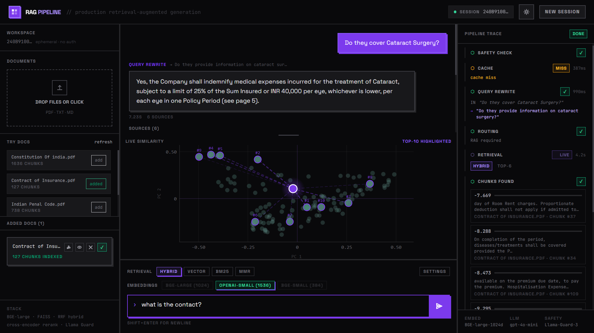
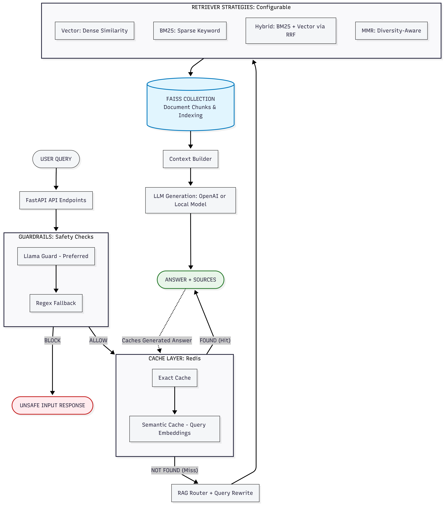

# SeeRAG Backend

Production RAG backend for [SeeRAG](https://seerag.vercel.app) (Live Link)
- Frontend Repo: <https://github.com/Sambhaji-Patil/seerag-frontend>

This service handles all AI/ML work: document ingestion, chunking, embedding, retrieval, reranking, generation, safety checks, caching, and RAG routing.

## What This Backend Does

- Ingests PDFs, TXT, and Markdown files.
- Chunks documents and stores them in FAISS collections.
- Supports multiple retrieval strategies: vector, BM25, hybrid RRF, and MMR.
- Uses OpenAI or local BGE embeddings depending on the selected mode.
- Builds answers with an LLM and streams the pipeline step-by-step.
- Applies guardrails with Llama Guard plus regex fallback.
- Caches exact and semantic answers in Redis.
- Generates live similarity data for the frontend visualizations.

## Architecture

### Request Flow

1. The request enters the FastAPI app.
2. Guardrails block unsafe input before retrieval starts.
3. Exact cache is checked first.
4. Semantic cache is checked next using the query embedding.
5. The query is rewritten for retrieval when needed.
6. The router can skip retrieval if the chat history already answers the question.
7. Retrieval runs with the selected strategy and weights.
8. The prompt is built from the retrieved context.
9. The answer is generated and cached again for future reuse.

## Retrieval And Ranking

The backend supports a few retrieval styles so you can compare quality and behavior:

- Vector: dense semantic similarity only.
- BM25: keyword-driven sparse search.
- Hybrid: BM25 + vector fusion using RRF.
- MMR: diversity-aware retrieval for less repetitive context.

Retrieval settings are configurable per request:

- `top_k`: final chunks shown to the LLM.
- `top_k_retrieval`: initial candidate pool.
- `mmr_lambda`: relevance vs diversity balance for MMR.
- `bm25_weight` and `vector_weight`: hybrid weighting.

## Embeddings

Embedding mode is selected per request and can use:

- `bge-large`
- `bge-small`
- `openai-small`
- `auto`

The backend chooses the right embedding runtime for the collection and normalizes vectors for cosine-based semantic search.

## Caching

Two cache layers are used:

- Exact cache: stores the full answer for an identical query, collection, and retrieval settings.
- Semantic cache: stores query embeddings in Redis and reuses an answer when a new query is close enough.

Cache behavior is keyed by retrieval mode and tuning parameters, so a hybrid answer does not collide with a vector-only or MMR answer.

## Safety

Incoming queries go through a guardrail layer before generation.

- Llama Guard is used when available.
- Regex fallback keeps the app working if the model cannot load.
- The backend also checks context for sensitive content before sending it to the LLM.

## API Endpoints

Core endpoints used by the frontend:

- `POST /ingest/file`
- `GET /ingest/jobs/{job_id}/events`
- `POST /query`
- `POST /query/pipeline`
- `GET /collections`
- `GET /collections/{collection_name}/viz`
- `POST /collections/{collection_name}/query_similarity`
- `POST /evaluate`

## Runtime And Deployment

This project uses the Docker runtime on Hugging Face Spaces.

- Backend repo: <https://github.com/Sambhaji-Patil/SeeRag-Backend>
- Frontend repo: <https://github.com/Sambhaji-Patil/seerag-frontend>
- Frontend app: <https://seerag.vercel.app>

## Environment Variables

Required:

- `OPENAI_API_KEY`
- `API_BEARER_TOKEN`

Optional:

- `EMBEDDING_DEVICE` default: `cuda`
- `CACHE_ENABLED` default: `false`
- `REDIS_URL` default: `redis://localhost:6379`
- `HF_TOKEN` required only when downloading gated Llama Guard weights

## Notes For Production

- CORS is restricted to the deployed frontend origin.
- The frontend must send the same bearer token in `Authorization: Bearer ...`.
- Restart the backend after changing secrets or environment variables.

## Local Development

The FastAPI app is started through the Docker container and listens on port `7860` in Spaces.

If you run locally, make sure the following are available:

- Python dependencies from `requirements.txt`
- A valid `OPENAI_API_KEY`
- Redis if you want caching enabled
- FAISS index data under `faiss_indexes/`
